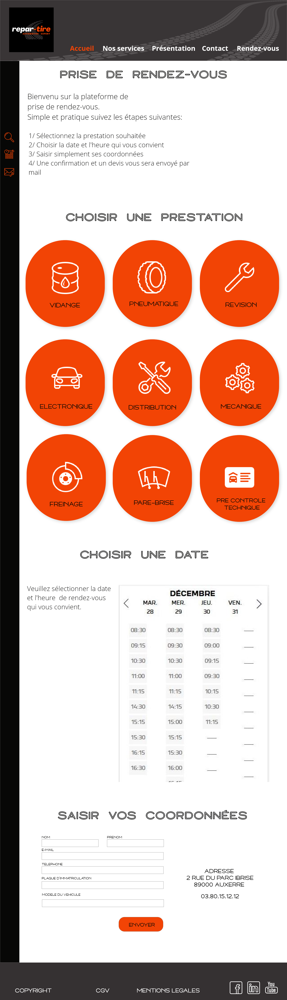
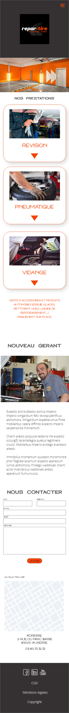

Readme 

#Projet de design REPAR-TIRE

# Description : 
Dans le cadre de la formation avec Access code School, nous avons eu l'exercice du Garage auto. Cela consister à imaginer 
un client: Thomas, qui rachète un garage auto et qui souhaite un site internet avec la possibilité de faire des réservation 
de service en ligne. 

Avec la demande particulière de rédiger un cahier des charge complet. 

# Notes :
Vous trouverez donc dans les dossiers : 
- le cahier des charges 
- l'analyse concurrentiel 
- le kit ui 
- le logo (sous différents formats) 
- le wireframe 
- le template format mobile et desktop

# Preview

